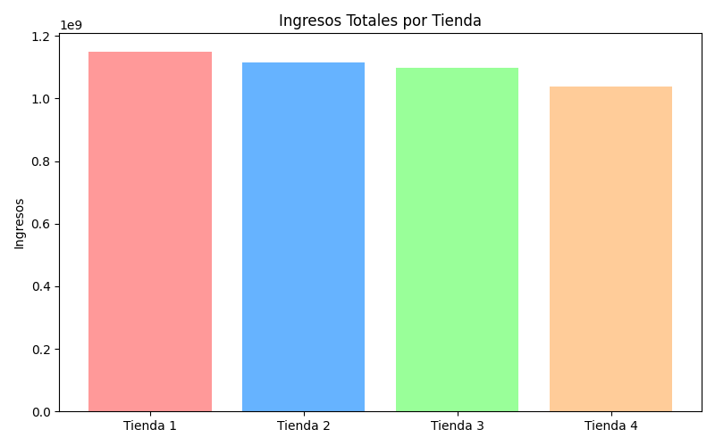
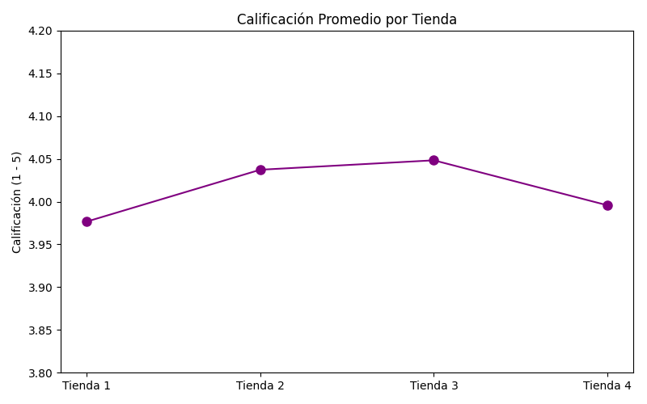
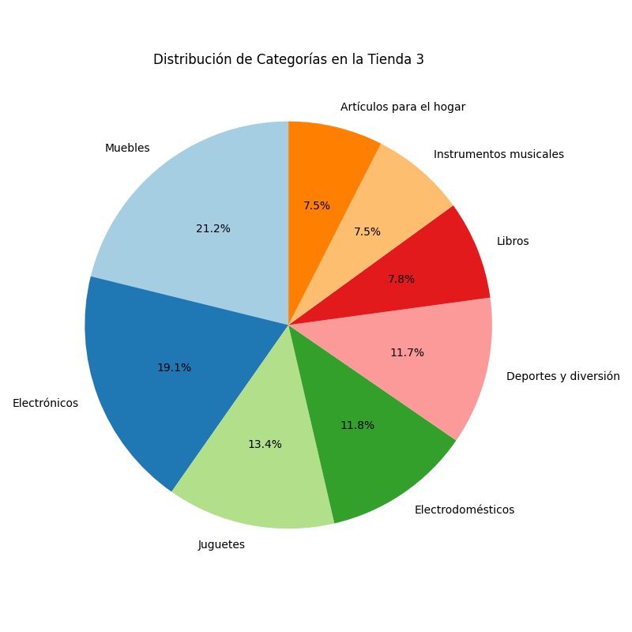

# 📊 Alura Store - Desafío de Análisis de Datos

¡Bienvenido(a) a este proyecto análisis de datos para la cadena Alura Store!

## 🎯 Propósito del Análisis
El objetivo principal de este proyecto es ayudar al Sr. Juan a tomar una decisión estratégica e informada sobre cuál de sus cuatro sucursales actuales debe vender para fondear un nuevo emprendimiento. 
Para lograrlo, se analizaron datos de facturación, volumen de productos, costos operativos y los niveles de satisfacción del cliente (calificaciones) de cada tienda. A lo largo del documento Jupyter Notebook (`AluraStoreLatam.ipynb`), abordamos todo el ciclo analítico, desde la carga y transformación de los datos, hasta la redacción de informes concluyentes sobre la eficiencia de las sucursales.

## 📂 Estructura del Proyecto y Archivos
La estructura base del repositorio se organiza de la siguiente manera:
```text
Challenge_Alura_Store/
  ├── AluraStoreLatam.ipynb   # Notebook principal con todo el análisis (Python/Pandas/Colab)
  ├── README.md               # Este archivo de documentación
  └── *.py                   # Archivos temporales de código (modificadores)
```
> **Nota:** Los datos de las tiendas se consumen directamente desde las URLs públicas correspondientes en github (archivos CSV: `tienda_1.csv`, `tienda_2.csv`, `tienda_3.csv`, `tienda_4.csv`).

## 📈 Insights y Hallazgos Principales

### 📊 Visualizaciones Generadas

| Ingresos Totales por Tienda | Calificación Promedio | Distribución (Tienda 3) |
|:---:|:---:|:---:|
|  |  |  |


1. **Eficiencia en Ingresos vs Costos de Envío:** La **Tienda 1** fue la que más facturó ($1,150 millones COP), sin embargo, arrastra el mayor costo de envío promedio y la calificación de cliente más baja. Esto indica un alto volumen de negocio pero márgenes y niveles de retención en riesgo de ineficiencia.
2. **Alta Satisfacción como Ventaja Competitiva:** La **Tienda 3** registró los niveles de satisfacción promedio de los clientes más altos (4.04 estrellas), manteniendo al mismo tiempo un gran volumen de ventas (1,098 millones COP) casi a la par con los líderes.
3. **Distribución de Ventas:** En su mayoría, las tiendas están dominadas por la venta de **Muebles** y **Electrónicos**. El producto más repetido que mejor funcionó fue el *Microondas*. 
4. **Decisión Final:** Basándonos en la excelente retención de clientes (mayor calificación) y la moderación en costos de envío (cercano o más bajo al promedio general), la **Tienda 3 fue la opción recomendada** para mantener y cultivar, por ser la operación más equilibrada y saludable a largo plazo.

### 🗺️ Extras Analizados: 
- El Notebook cuenta con gráficos interactivos Heatmap generados con `Folium` y Scatterplots creados para analizar cómo la ubicación geográfica en la que compran los clientes afecta las ventas de cada sede.

## 💻 Instrucciones de Uso

Para ejecutar y explorar este análisis localmente o en la web:

**1. A través de Google Colab (Recomendado):**
   - Importa o abre el archivo `AluraStoreLatam.ipynb` directamente en [Google Colaboratory](https://colab.research.google.com/).
   - Dirígete al menú "Entorno de ejecución > Ejecutar todas" para cargar los *DataFrames*, generar los informes y levantar los mapas y gráficas en vivo.
   - ¡Listo! Disfruta la interactividad de Colab.

**2. Ejecución Local (Jupyter Notebooks):**
   - Asegúrate de tener Python 3.9+ instalado en tu máquina.
   - Instala las dependencias necesarias. Podrías ejecutar:  
    `pip install pandas matplotlib seaborn folium jupyter notebook`
   - Inicia Jupyter abriendo tu terminal en la carpeta principal del proyecto y corriendo:
    `jupyter notebook`
   - Selecciona `AluraStoreLatam.ipynb` en tu explorador y ejecuta las celdas una a una.